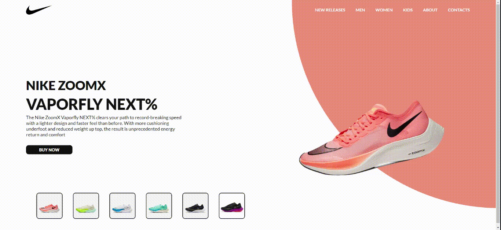
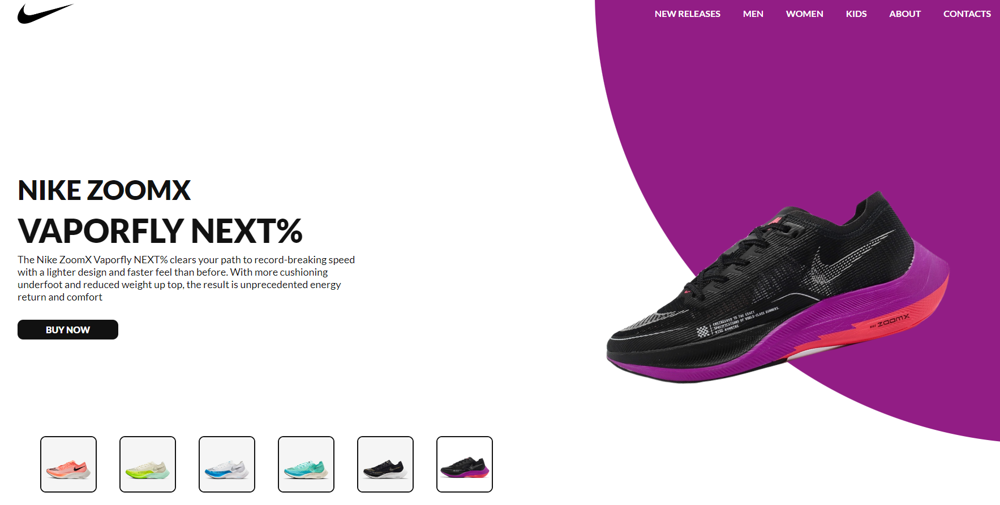
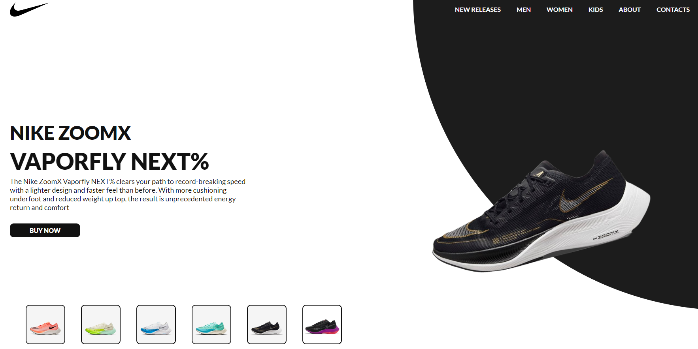
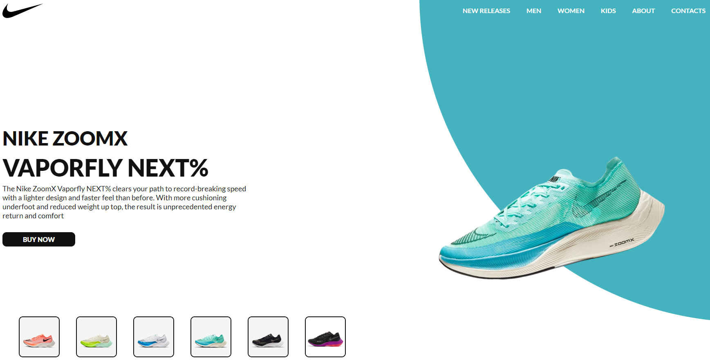
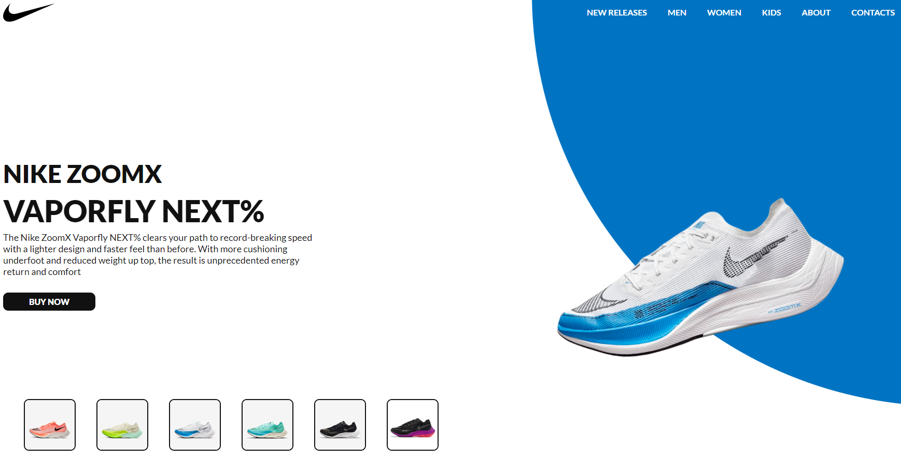
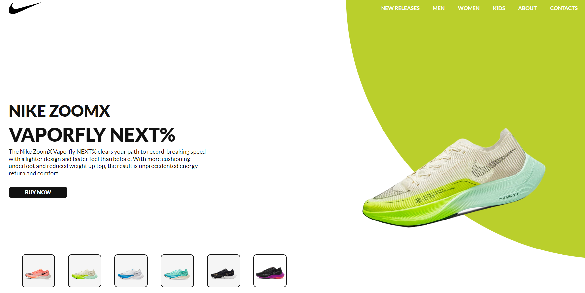
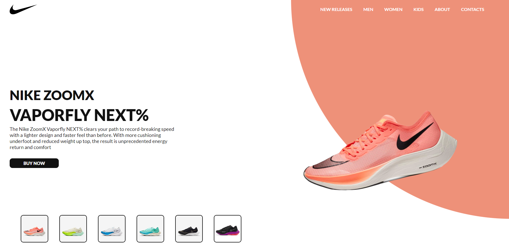

# :triangular_ruler: Nome do Projeto

# :memo: Índice

# :chart_with_upwards_trend: Proposta

# :trophy: Desafio

# :hammer_and_wrench: Tecnologias

# :dart: Objetivo

# :open_book: Aprendizado

# :camera: Imagens do Projeto
* Gif Apresentação do Projeto

* Imagem do Projeto - Circle Roxo

* Imagem do Projeto - Circle Preto

* Imagem do Projeto - Circle Azul Claro

* Imagem do Projeto - Circle Azul Escuro

* Imagem do Projeto - Circle Verde

* Imagem do Projeto - Circle Salmão

# :link: Links

# :technologist: Autor
