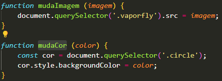

# :triangular_ruler: Landing Page Vaporfly
* Landing Page do tênis de maratonista Vaporfly da marca Nike.

# :memo: Índice
* [Proposta](https://github.com/rodrigobarros2802/landing_page_vaporfly/blob/master/README.md#chart_with_upwards_trend-proposta)
* [Desafio](https://github.com/rodrigobarros2802/landing_page_vaporfly/blob/master/README.md#trophy-desafio)
* [Tecnologias](https://github.com/rodrigobarros2802/landing_page_vaporfly/blob/master/README.md#hammer_and_wrench-tecnologias)
* [Objetivo](https://github.com/rodrigobarros2802/landing_page_vaporfly/blob/master/README.md#dart-objetivo)
* [Aprendizado](https://github.com/rodrigobarros2802/landing_page_vaporfly/blob/master/README.md#open_book-aprendizado)
* [Imagens do Projeto](https://github.com/rodrigobarros2802/landing_page_vaporfly/blob/master/README.md#camera-imagens-do-projeto)
* [Link Deploy](https://github.com/rodrigobarros2802/landing_page_vaporfly/blob/master/README.md#link-link-deploy)
* [Autor](https://github.com/rodrigobarros2802/landing_page_vaporfly/blob/master/README.md#technologist-autor)

# :chart_with_upwards_trend: Proposta
* Meu primeiro projeto criado do absoluto zero, que foi proposto na mentoria de DEV's na qual eu faço parte chamada Conquiste Sua Vaga.

# :trophy: Desafio
* O Maior desafio desse projeto foi desenvolver do absoluto zero sem ajuda de um guia tutorial proposto em curso, com o prazo máximo de entrega de 6 dias. 
* Deixar o projeto responsivo em todos os dispositivos móveis.

# :hammer_and_wrench: Tecnologias
* JavaScript
* HTML
* CSS

# :dart: Objetivo
* Meu maior objetivo nesse projeto, foi melhorar ainda mais o que eu tinha feito no início dele, pois quando criei esse projeto eu sabia que tinha muito a melhorar e ainda tem, sendo que sinto uma evolução muito positiva em relação a primeira criação.

# :open_book: Aprendizado

  

# :camera: Imagens do Projeto
* Gif Apresentação do Projeto

* Imagem do Projeto - Circle Roxo

* Imagem do Projeto - Circle Preto

* Imagem do Projeto - Circle Azul Claro

* Imagem do Projeto - Circle Azul Escuro

* Imagem do Projeto - Circle Verde

* Imagem do Projeto - Circle Salmão

# :link: Link Deploy
Deploy - https://relaxed-taiyaki-7a7e0c.netlify.app/

# :technologist: Autor
* LinkedIn - https://www.linkedin.com/in/rodrigobarros2802/

* GitHub - https://github.com/rodrigobarros2802
